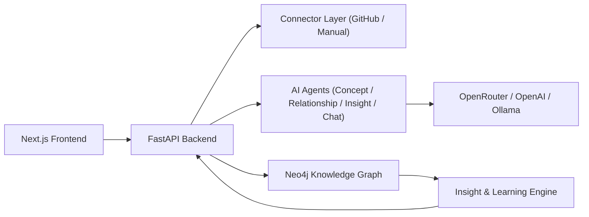

# Repo Teacher

Repo Teacher is a GitHub repo analysis app that explains the computer science and software engineering concepts already present in a codebase.

## What It Does

- Accepts a GitHub repository URL or `owner/repo`
- Pulls repo metadata, README content, file-tree structure, and key source/config files
- Detects foundational concepts such as:
  - client-server architecture
  - state management
  - asynchronous programming
  - data modeling and persistence
  - testing and verification
  - abstraction and separation of concerns
- Builds a graph of:
  - `Resource`, `Platform`, `Field`, `Concept`, and related nodes
- Produces:
  - a plain-English repo summary
  - concept cards with why-each-concept-matters explanations
  - file-backed evidence
  - a suggested learning path

## Product Focus

- Help vibecoders understand what they built
- Teach CS through the learner's own codebase instead of generic lessons
- Keep explanations grounded in observable repo signals
- Build a reusable concept graph for exploration and chat

## Architecture



## Repo Analysis Example

```bash
curl -X POST http://localhost:8000/resources \
  -H "Content-Type: application/json" \
  -d '{
    "source": "github",
    "identifier": "openai/openai-cookbook"
  }'
```

## How To Run

### Option 1: Docker Compose

This is the fastest way to run the full stack.

1. `cd prism/docker`
2. Optional: export an LLM key if you want richer explanations.
3. `docker compose up --build`

Open:
- Frontend: `http://localhost:3000`
- Backend docs: `http://localhost:8000/docs`
- Neo4j Browser: `http://localhost:7474`

Optional LLM environment variables before `docker compose up`:

```bash
export MODEL_PROVIDER=openai
export OPENAI_API_KEY=your_key_here
```

You can also use OpenRouter instead:

```bash
export MODEL_PROVIDER=openrouter
export OPENROUTER_API_KEY=your_key_here
```

If you do not set an API key, the app still runs and falls back to heuristic concept detection.

### Option 2: Run Locally

Start Neo4j first. The simplest way is to run only Neo4j through Docker:

```bash
cd prism/docker
docker compose up neo4j
```

Then start the backend in a new terminal:

```bash
cd prism/backend
python3 -m venv .venv
source .venv/bin/activate
pip install -r requirements.txt

export NEO4J_URI=bolt://localhost:7687
export NEO4J_USERNAME=neo4j
export NEO4J_PASSWORD=prismneo

# Optional for LLM-backed explanations
# export MODEL_PROVIDER=openai
# export OPENAI_API_KEY=your_key_here

uvicorn main:app --reload --host 0.0.0.0 --port 8000
```

Then start the frontend in another terminal:

```bash
cd prism/frontend
npm install
export NEXT_PUBLIC_API_BASE_URL=http://localhost:8000
npm run dev
```

Open:
- Frontend: `http://localhost:3000`
- Backend docs: `http://localhost:8000/docs`

### Quick Test

Once the app is running, analyze a repo from the UI or hit the API directly:

```bash
curl -X POST http://localhost:8000/resources \
  -H "Content-Type: application/json" \
  -d '{
    "source": "github",
    "identifier": "openai/openai-cookbook"
  }'
```

## Notes

- GitHub analysis is strongest on public repositories with readable README/config structure.
- When an LLM provider is configured, concept explanations can be enriched beyond heuristics.
- Default Neo4j credentials in compose are isolated for the app (`neo4j/prismneo`) with a dedicated Docker volume.
