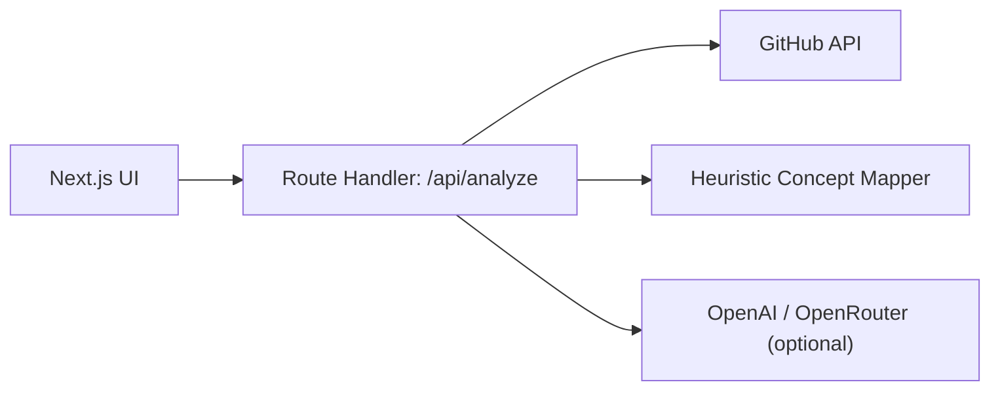

# Repo Teacher

Repo Teacher is a single Next.js app that turns a public GitHub repository into a guided lesson on the computer science and software engineering ideas already present in the code.

## Product Shape

- Paste a GitHub repo URL or `owner/repo`
- Pull the README, language mix, tree structure, and a handful of key files directly from GitHub
- Detect concepts such as:
  - client-server architecture
  - state management
  - asynchronous programming
  - data modeling
  - testing and verification
  - abstraction and separation of concerns
  - prompt-oriented AI integration
- Return:
  - a repo summary
  - an architecture explanation
  - concept cards with why-each-concept-matters teaching
  - file-backed evidence
  - a learning path

## Architecture



There is no separate Python backend anymore. The analysis logic runs server-side inside the Next.js app.

## How To Run

### Local

```bash
cd prism/frontend
npm install
npm run dev
```

Open [http://localhost:3000](http://localhost:3000).

### Optional environment variables

Set these in `prism/frontend/.env.local` if you want richer behavior:

```bash
GITHUB_TOKEN=your_github_token
MODEL_PROVIDER=auto

# OpenAI
OPENAI_API_KEY=your_openai_key
OPENAI_MODEL=gpt-4o-mini

# Or OpenRouter
OPENROUTER_API_KEY=your_openrouter_key
OPENROUTER_MODEL=openai/gpt-4o-mini
OPENROUTER_SITE_URL=http://localhost:3000
```

Notes:

- `GITHUB_TOKEN` raises GitHub API limits.
- If no LLM key is set, the app still works and falls back to heuristic analysis.

### Docker

```bash
cd prism/docker
docker compose up --build
```

Open [http://localhost:3000](http://localhost:3000).

## API

`POST /api/analyze`

Example:

```bash
curl -X POST http://localhost:3000/api/analyze \
  -H "Content-Type: application/json" \
  -d '{
    "identifier": "openai/openai-cookbook"
  }'
```

## Current MVP Boundaries

- Best with public GitHub repositories
- Strongest when the repo has a clear README and recognizable app structure
- Uses sampled files, not a full clone or full semantic index
- Optimized for teaching and orientation, not exact static analysis
