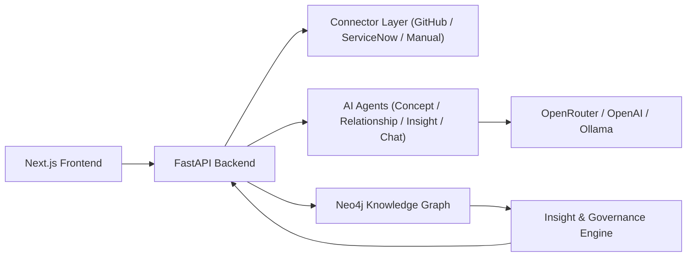

# Prism

Prism is an enterprise intelligence platform that maps systems, resources, concepts, owners, and cross-platform relationships using AI.

## What It Does

- Ingests enterprise resources from:
  - GitHub repositories
  - ServiceNow configuration items (stubbed connector pattern)
  - Manual/custom sources
- Builds a graph of:
  - `Resource`, `Platform`, `Field`, `Concept`, and related nodes
- Extracts concepts and relationships using pluggable LLM providers
- Exposes:
  - `POST /resources`
  - `GET /graph`
  - `GET /insights`
  - `POST /chat`

## Architecture



## Enterprise Resource Ingestion Example

```bash
curl -X POST http://localhost:8000/resources \
  -H "Content-Type: application/json" \
  -d '{
    "source": "github",
    "identifier": "kubernetes/kubernetes",
    "tags": ["platform", "infrastructure"]
  }'
```

## Run

1. `cd prism/docker`
2. `docker compose up --build`

Open:
- Frontend: `http://localhost:3000`
- Backend docs: `http://localhost:8000/docs`
- Neo4j Browser: `http://localhost:7474`

## Notes

- This project was bootstrapped from `bookgraph/` and adapted for enterprise data mapping.
- ServiceNow ingestion is currently a connector stub pattern; replace with real API auth/query flow for production.
